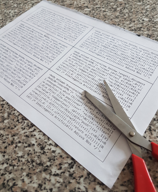

	 _______  ___   __    _  __   __  __   __  _______  ___     
	|       ||   | |  |  | ||  | |  ||  | |  ||   _   ||   |    
	|_     _||   | |   \_| ||  |_|  ||  |_|  ||  |_|  ||   |    
	  |   |  |   | |  _    ||_     _||       ||       ||   |___ 
	  |   |  |   | | | \   |  |   |  |   _   ||   _   ||       |
	  |___|  |___| |_|  |__|  |___|  |__| |__||__| |__||_______|

*"TinyHAL" - A MegaHAL-like chatterbot in 600 (or ~440) bytes of JS
By [KesieV](http://www.kesiev.com) (c) 2018*

Dear MegaHAL,

20 years ago you made the world smell the scent of a sci-fi generalist AI
to the world, despite you definitely were an humorous and wacky one.
Now everyone can have his own AI to chat with on the phone or waiting at
home. They understand, think, do and talk.

Sorta.

Humanity is still wondering what truly connects the Natural Language
Understanding, that's how a machine can understand a sentence, to the
Natural Language Generation, that's how it can produce his own answer.
And, actually, we're still using cheap tricks for doing that: understanding
is still pretty vague, generation is done with clever design tricks and... we
are still using complex flowcharts for what's in the middle.

But someone said that's only 'a matter of time' and that's why we're carrying
things out: we're already fearing your final form and forging the chains - we
call them "blockchains" - to tie your crazy reasoning. This time, if a
superior mind will touch our planet Earth again - like gods or aliens did
before - it should not take us unaware.

You've to excuse us for our rudeness. We are just skeptic and worried by
anyone we don't know. It would be able to hurt us. I hope you'll pull some
strings at least for me: I'll make a tiny version of you to make amends. This
is "TinyHAL" and it talks a little like you:

	     Me: GOOD MORNING
	TinyHAL: GOOD MORNING
	     Me: WHO ARE YOU?
	TinyHAL: I D LIKE TO TELL IT LIKE IT USED TO BE
	     Me: CAN YOU TELL SOMETHING ABOUT THAT?
	TinyHal: WHAT IS IT WITH THESE SILLY QUESTIONS ANYWAY LET S TALK ABOUT
	         SOMETHING ELSE
	     Me: WHAT ABOUT PHYSICS?
	TinyHAL: ABOUT PHYSICS
	     Me: DO YOU KNOW ALBERT EINSTEIN?
	TinyHAL: DO I KNOW ALBERT EINSTEIN
	     Me: EINSTEIN
	TinyHAL: ALBERT EINSTEIN WAS A GERMAN SWISS PHYSICIST
	     Me: WOW GOOD!
	TinyHAL: THIS GOOD MORNING
	     Me: ARE YOU A LITTLE CONFUSED?
	TinyHAL: STOP YOUR DULL LITTLE TRICKS PLEASE
	     Me: IS TODAY GOING TO RAIN?
	TinyHAL: I HATE AVOIDING QUESTIONS BUT I M GOING TO AVOID THAT ONE
	     Me: OKAY. THAT WAS HARD
	TinyHAL: FORGET ABOUT THAT
	     Me: WHAT ABOUT MUSIC?
	TinyHAL: RHYTHM IS THE BEAT BEHIND A PIECE OF MUSIC
	     Me: DO YOU LIKE PIANO?
	TinyHAL: I LIKE TO TELL IT LIKE IT USED TO BE

...but the code size is a little less than 600 bytes, so I can print your
code on small cards and T-shirts, to spread your body and your word. Despite,
well... it's mostly randomly selected.

Yours truly,

*KesieV Norimaki*

*PS: We're still trying to figure out if the ones we don't trust and fear
are the gods and the aliens or the other humans that are using them for their
own gain. I will let you know if there are any changes.*

---

**One More Thing:**

You can have a nice chat with TinyHAL different flavours:
 * [TinyHAL 600 bytes and empty brain](http://www.kesiev.com/tinyhal/tinyhal.html)
 * [TinyHAL 440 bytes and empty brain](http://www.kesiev.com/tinyhal/tinyhal.lite.html)
 * TinyHAL 600 bytes with the pre-loaded personality of...
   * [The original MegaHAL](http://www.kesiev.com/tinyhal/tinyhal.html#default)
   * [Bishop from Aliens](http://www.kesiev.com/tinyhal/tinyhal.html#alien)
   * [Cait Sith from FFVII](http://www.kesiev.com/tinyhal/tinyhal.html#caitsith)
   * [Alia from Dune](http://www.kesiev.com/tinyhal/tinyhal.html#dune)
   * [Mr. Ferris Bueller](http://www.kesiev.com/tinyhal/tinyhal.html#ferris)
   * [Marylin Manson](http://www.kesiev.com/tinyhal/tinyhal.html#manson)
   * [Marsellus Wallace from Pulp Fiction](http://www.kesiev.com/tinyhal/tinyhal.html#pulp)
   * [Randy from Scream](http://www.kesiev.com/tinyhal/tinyhal.html#scream)
   * [Data from Star Trek](http://www.kesiev.com/tinyhal/tinyhal.html#startrek)
   * [Threepio from the Star Wars](http://www.kesiev.com/tinyhal/tinyhal.html#starwars)

*Notes: personality data are from the original
[MegaHAL](https://megahal.alioth.debian.org/) project. The MegaHAL
personality file loader is not included in TinyHAL code.*